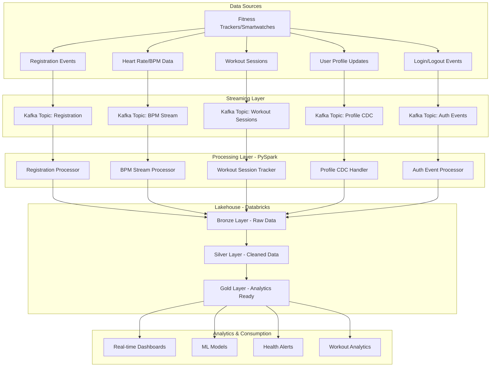

# 🏋️ PySpark Kafka Streaming Pipeline - Gym Data Processing

<div align="center">

[](https://spark.apache.org/)
[](https://kafka.apache.org/)
[](https://databricks.com/)
[](https://python.org/)

*A real-time streaming data pipeline for processing gym/fitness IoT device data using PySpark, Kafka, and Databricks in a Lakehouse architecture*

</div>

## 🏗️ Architecture Overview

This project implements a **medallion architecture** (Bronze-Silver-Gold) streaming pipeline that processes real-time gym and fitness data from wearable IoT devices. The pipeline handles user registrations, biometric monitoring, workout sessions, and user authentication in real-time.

### System Architecture



## 🎯 Key Features

- ⚡ **Real-time Processing**: Sub-second latency for critical health metrics
- 💓 **Biometric Monitoring**: Continuous heart rate and health data processing
- 🏋️ **Workout Analytics**: Session tracking with performance metrics
- 👤 **User Management**: Registration, profile updates via Change Data Capture
- 🔐 **Authentication**: Login/logout event processing and session management
- 📊 **Multi-layered Architecture**: Bronze-Silver-Gold data organization
- 🛡️ **Fault Tolerance**: Built-in error handling and recovery mechanisms
- 📈 **Scalable**: Handles thousands of concurrent device streams

## 📊 Data Flow Components

### 1. 📱 Registration Stream
**Purpose**: Handles new user and device registrations
- **Input**: Smartwatch/fitness device registration events
- **Processing**: Data validation, enrichment, and user profile creation
- **Output**: Clean user records in lakehouse

### 2. 👤 User Profile (CDC)
**Purpose**: Change Data Capture for real-time profile updates
- **Input**: Profile modification events (INSERT, UPDATE, DELETE)
- **Processing**: Version control, data quality checks, historical tracking
- **Output**: Versioned user profiles with audit trail

### 3. 💓 BPM Stream
**Purpose**: Real-time heart rate and biometric data processing
- **Input**: Continuous heart rate data from wearable devices
- **Processing**: Anomaly detection, sliding window aggregations, health thresholds
- **Output**: Health metrics, alerts, and trend analysis

### 4. 🏋️ Workout Session
**Purpose**: Exercise session lifecycle management
- **Input**: Workout start/stop events, exercise data
- **Processing**: Duration calculation, intensity analysis, performance tracking
- **Output**: Workout summaries and performance metrics

### 5. 🔐 Login/Logout
**Purpose**: User authentication and session management
- **Input**: Authentication events from gym access systems
- **Processing**: Session tracking, facility utilization, user behavior analysis
- **Output**: Access logs, gym occupancy metrics

## 🛠️ Technology Stack

| Component | Technology | Purpose |
|-----------|------------|---------|
| **Stream Processing** | Apache Spark (PySpark) | Real-time data processing |
| **Message Broker** | Apache Kafka | Event streaming and buffering |
| **Data Platform** | Databricks | Unified analytics platform |
| **Storage** | Delta Lake | ACID transactions on data lake |
| **Programming** | Python 3.8+ | Primary development language |
| **Architecture** | Medallion (Bronze-Silver-Gold) | Data organization pattern |

## 📁 Project Structure

```
pyspark-kafka-streaming-pipeline/
├── 📂 src/
│   ├── 📂 streaming/
│   │   ├── 📄 registration_stream.py        # Device/user registration processing
│   │   ├── 📄 profile_cdc_stream.py         # Profile change data capture
│   │   ├── 📄 bpm_stream_processor.py       # Heart rate/biometric processing
│   │   ├── 📄 workout_session_stream.py     # Exercise session tracking
│   │   ├── 📄 auth_stream_processor.py      # Login/logout event processing
│   │   └── 📄 main_pipeline.py              # Orchestrator for all streams
│   ├── 📂 utils/
│   │   ├── 📄 kafka_utils.py                # Kafka producer/consumer utilities
│   │   ├── 📄 spark_utils.py                # Spark session management
│   │   ├── 📄 data_transformations.py       # Common transformation functions
│   │   └── 📄 health_analytics.py           # Health-specific calculations
│   ├── 📂 config/
│   │   ├── 📄 kafka_config.py               # Kafka broker configurations
│   │   ├── 📄 spark_config.py               # Spark cluster settings
│   │   └── 📄 health_thresholds.py          # Health alert configurations
│   └── 📂 schemas/
│       ├── 📄 registration_schema.py        # Registration event schema
│       ├── 📄 bpm_schema.py                 # Biometric data schema
│       └── 📄 workout_schema.py             # Workout session schema
├── 📂 notebooks/
│   ├── 📄 01_data_exploration.ipynb         # Data analysis and exploration
│   ├── 📄 02_pipeline_testing.ipynb         # End-to-end testing
│   └── 📄 03_health_analytics.ipynb         # Health metrics analysis
├── 📂 docker/
│   ├── 📄 docker-compose.yml                # Local development environment
│   ├── 📄 kafka.dockerfile                  # Kafka container setup
│   └── 📄 spark.dockerfile                  # Spark container setup
├── 📂 docs/
│   ├── 📄 ARCHITECTURE.md                   # Detailed architecture guide
│   ├── 📄 SETUP.md                          # Step-by-step setup instructions
│   └── 📄 API_REFERENCE.md                  # Code documentation
├── 📂 tests/
│   ├── 📂 unit/
│   │   ├── 📄 test_bpm_processor.py         # BPM processing tests
│   │   └── 📄 test_transformations.py       # Transformation logic tests
│   └── 📂 integration/
│       └── 📄 test_end_to_end.py            # Full pipeline tests
├── 📄 requirements.txt                      # Python dependencies
├── 📄 setup.py                             # Package setup
└── 📄 README.md                            # This file
```

## 🚀 Quick Start

### Prerequisites

- **Python 3.8+**
- **Apache Spark 3.4+** 
- **Apache Kafka 2.8+**
- **Databricks Runtime 13.0+** (or local Spark cluster)
- **Docker & Docker Compose** (for local development)

### Installation

1. **Clone the repository**
```bash
git clone https://github.com/Patel308/pyspark-kafka-streaming-pipeline.git
cd pyspark-kafka-streaming-pipeline
```

2. **Install Python dependencies**
```bash
pip install -r requirements.txt
```

3. **Start local development environment**
```bash
# Start Kafka, Zookeeper, and Spark
docker-compose -f docker/docker-compose.yml up -d
```

4. **Configure environment variables**
```bash
export KAFKA_BOOTSTRAP_SERVERS="localhost:9092"
export SPARK_MASTER="local[*]"
export DATABRICKS_HOST="https://your-workspace.databricks.com"
export DATABRICKS_TOKEN="your-access-token"
```

### Running the Pipeline

```bash
# Start all streaming processors
python src/streaming/main_pipeline.py

# Or run individual components
python src/streaming/bpm_stream_processor.py
python src/streaming/workout_session_stream.py
```

## 📊 Data Schemas

### Registration Event Schema
```json
{
  "user_id": 10948,
  "device_id": "FT_001_119715",
  "timestamp": 1575891600,
  "action": "register",
  "user_profile": {
    "first_name": "John",
    "last_name": "Doe", 
    "email": "john.doe@email.com",
    "age": 28,
    "gender": "M",
    "address": {
      "street_address": "501 Kelly Tunnel Apt. 905",
      "city": "Los Angeles",
      "state": "CA", 
      "zip": "90210"
    }
  }
}
```

### BPM/Heart Rate Data Schema
```json
{
  "device_id": "119715",
  "user_id": 10948,
  "timestamp": 1575158400,
  "heartrate": 66.62,
  "activity_level": "moderate",
  "calories_burned": 45.
