 # 🏋️ PySpark Kafka Streaming Pipeline - Gym Data Processing

<div align="center">

[](https://spark.apache.org/)
[](https://kafka.apache.org/)
[](https://databricks.com/)
[](https://python.org/)

*A real-time streaming data pipeline for processing gym/fitness IoT device data using PySpark, Kafka, and Databricks in a Lakehouse architecture*


</div>

## 🏗️ Architecture Overview

This project implements a **medallion architecture** (Bronze-Silver-Gold) streaming pipeline that processes real-time gym and fitness data from wearable IoT devices. The pipeline handles user registrations, biometric monitoring, workout sessions, and user authentication in real-time using Databricks lakehouse platform.

### System Architecture Flow

```mermaid
graph TB
    subgraph "IoT Data Sources"
        A[🏃 Fitness Trackers] --> B[📱 Registration Events]
        A --> C[💓 Heart Rate/BPM Data]
        A --> D[🏋️ Workout Sessions]
        A --> E[👤 User Profile Updates]
        A --> F[🔐 Login/Logout Events]
    end
    
    subgraph "Streaming Ingestion"
        B --> G[Kafka: Registration Topic]
        C --> H[Kafka: BPM Stream Topic]
        D --> I[Kafka: Workout Topic]
        E --> J[Kafka: Profile CDC Topic]
        F --> K[Kafka: Auth Events Topic]
    end
    
    subgraph "Databricks Processing - PySpark"
        G --> L[01-Config & 02-Setup]
        H --> L
        I --> L
        J --> L
        K --> L
        L --> M[04-Bronze Layer]
        M --> N[05-Silver Layer]
        N --> O[06-Gold Layer]
        P[07-Run Pipeline] --> M
        P --> N
        P --> O
    end
    
    subgraph "Data Lake Storage"
        M --> Q[📊 Raw Data Storage]
        N --> R[🧹 Cleaned & Validated]
        O --> S[📈 Analytics Ready]
    end
    
    subgraph "Consumption Layer"
        S --> T[🔔 Real-time Health Alerts]
        S --> U[📊 Workout Analytics Dashboard]
        S --> V[🤖 ML Models & Predictions]
        S --> W[📋 Gym Management Reports]
    end
```



## 🎯 Key Features

- ⚡ **Real-time Processing**: Sub-second latency for critical health metrics and alerts
- 💓 **Biometric Monitoring**: Continuous heart rate monitoring with anomaly detection
- 🏋️ **Workout Analytics**: Session tracking, performance metrics, and trend analysis
- 👤 **User Management**: Registration, profile updates via Change Data Capture (CDC)
- 🔐 **Authentication**: Secure login/logout event processing and session management
- 📊 **Medallion Architecture**: Bronze-Silver-Gold data organization for data quality
- 🛡️ **Fault Tolerance**: Built-in error handling, recovery mechanisms, and data validation
- 📈 **Auto-scaling**: Handles thousands of concurrent device streams efficiently
- 🚀 **Cloud-native**: Optimized for Databricks and Azure cloud deployment

## 📊 Data Pipeline Components

### 1. 📱 **Registration Stream Processing**
**Purpose**: Handles new user and fitness device registrations
- **Input**: Smartwatch/fitness tracker registration events
- **Processing**: Data validation, user profile creation, device binding
- **Output**: Clean user records with validated profiles in lakehouse

### 2. 👤 **User Profile Change Data Capture (CDC)**
**Purpose**: Real-time profile updates and synchronization
- **Input**: Profile modification events (INSERT, UPDATE, DELETE operations)
- **Processing**: Version control, data quality validation, audit trail maintenance
- **Output**: Versioned user profiles with complete change history

### 3. 💓 **BPM/Heart Rate Stream Processing**
**Purpose**: Real-time biometric data processing and health monitoring
- **Input**: Continuous heart rate data from wearable devices
- **Processing**: Anomaly detection, sliding window aggregations, health threshold monitoring
- **Output**: Health metrics, real-time alerts, trend analysis for medical insights

### 4. 🏋️ **Workout Session Tracking**
**Purpose**: Exercise session lifecycle and performance management
- **Input**: Workout start/stop events, exercise intensity data, session metadata
- **Processing**: Duration calculation, calorie tracking, performance analysis, goal progress
- **Output**: Comprehensive workout summaries and personalized performance insights

### 5. 🔐 **Authentication & Access Management**
**Purpose**: User authentication and gym facility access control
- **Input**: Login/logout events from gym access systems and mobile apps
- **Processing**: Session management, facility utilization tracking, security monitoring
- **Output**: Access logs, gym occupancy metrics, user behavior analytics

## 📁 Project Structure

```
pyspark-kafka-streaming-pipeline/
├── 📂 Data Set/                            # Sample data files for testing and development
│   ├── 📄 1-registered_users_1.csv         # User registration sample data
│   ├── 📄 1-registered_users_2.csv         # Additional user registration data  
│   ├── 📄 2-user_info_1.json               # User profile information (JSON format)
│   ├── 📄 2-user_info_2.json               # Additional user profile data
│   ├── 📄 3-bpm_1.json                     # Heart rate/BPM sample data
│   ├── 📄 3-bpm_2.json                     # Additional BPM streaming data
│   ├── 📄 4-workout_1.json                 # Workout session sample data
│   ├── 📄 4-workout_2.json                 # Additional workout session data
│   ├── 📄 5-gym_logins_1.csv               # Gym login/logout events
│   ├── 📄 5-gym_logins_2.csv               # Additional login event data
│   ├── 📄 6-date-lookup.json               # Date lookup reference data
│   ├── 📄 7-gym_summary_1.parquet          # Processed gym analytics (Parquet format)
│   ├── 📄 7-gym_summary_2.parquet          # Additional analytics summaries
│   └── 📄 8-workout_bpm_summary.parquet    # Combined workout + BPM analytics
│
├── 📂 Notebooks/                           # Databricks notebooks for pipeline processing
│   ├── 📄 01-config.py                     # Configuration and environment setup
│   ├── 📄 02-setup.py                      # Databricks cluster and connection setup
│   ├── 📄 03-history-loader.py             # Historical data loading utilities
│   ├── 📄 04-bronze.py                     # Bronze layer - Raw data ingestion
│   ├── 📄 05-silver.py                     # Silver layer - Data transformation & cleaning
│   ├── 📄 06-gold.py                       # Gold layer - Analytics & aggregations
│   ├── 📄 07-run.py                        # Main pipeline orchestration runner
│   ├── 📄 08-batch-test.py                 # Batch processing validation tests
│   ├── 📄 09-stream-test.py                # Streaming pipeline validation tests
│   └── 📄 10-producer.py                   # Kafka producer for generating test data
│
├── 📂 Other Code/                          # Deployment scripts and additional utilities
│   ├── 📂 DemoJobDeploy/                   # Deployment automation scripts
│   │   ├── 📄 azure_build_pipeline.yaml   # Azure DevOps CI/CD pipeline
│   │   ├── 📄 deploy-notebooks.sh          # Databricks notebook deployment script
│   │   └── 📄 deploy.sh                    # Main deployment orchestration script
│   └── 📄 run_integration_test.sh          # End-to-end integration testing script
│
├── 📄 .gitignore                           # Git ignore patterns and exclusions
└── 📄 README.md                            # Project documentation (this file)
```

## 🛠️ Technology Stack

| Component | Technology | Version | Purpose |
|-----------|------------|---------|---------|
| **Stream Processing** | Apache Spark (PySpark) | 3.4+ | Distributed real-time data processing |
| **Message Broker** | Apache Kafka | 2.8+ | Event streaming and reliable message delivery |
| **Data Platform** | Databricks | Runtime 13.0+ | Unified analytics and lakehouse platform |
| **Storage** | Delta Lake | Latest | ACID transactions and versioning on data lake |
| **Cloud Platform** | Microsoft Azure | Latest | Cloud infrastructure and services |
| **Programming** | Python | 3.8+ | Primary development language |
| **Architecture Pattern** | Medallion (Bronze-Silver-Gold) | - | Data quality and governance framework |
| **Deployment** | Azure DevOps | Latest | CI/CD pipeline automation |

## 🚀 Quick Start Guide

### Prerequisites

Before running the pipeline, ensure you have:

- **Databricks Workspace** (Community or Premium)
- **Apache Kafka Cluster** (local or cloud-based)
- **Python 3.8+** with PySpark libraries
- **Azure Account** (for cloud deployment)
- **Git** for version control

### Installation & Setup

1. **Clone the Repository**
```bash
git clone https://github.com/Patel308/pyspark-kafka-streaming-pipeline.git
cd pyspark-kafka-streaming-pipeline
```

2. **Upload to Databricks Workspace**
```bash
# Using Databricks CLI (install first: pip install databricks-cli)
databricks configure --token
databricks workspace import-dir Notebooks/ /Shared/gym-streaming-pipeline/
```

3. **Deploy Using Automation Scripts**
```bash
# Make deployment scripts executable
chmod +x Other\ Code/DemoJobDeploy/deploy.sh
chmod +x Other\ Code/DemoJobDeploy/deploy-notebooks.sh

# Run deployment
./Other\ Code/DemoJobDeploy/deploy.sh
```

4. **Configure Environment Variables**
```bash
# Set in Databricks notebook or cluster environment
KAFKA_BOOTSTRAP_SERVERS = "your-kafka-broker:9092"
DATABRICKS_HOST = "https://your-workspace.databricks.com"
DATABRICKS_TOKEN = "your-access-token"
```

### Running the Pipeline

#### Step-by-Step Execution

```bash
# 1. Configure environment and connections
python Notebooks/01-config.py

# 2. Set up Databricks cluster and dependencies  
python Notebooks/02-setup.py

# 3. Load historical data for context and testing
python Notebooks/03-history-loader.py

# 4. Run the complete medallion pipeline
python Notebooks/07-run.py
```

#### Individual Layer Processing

```bash
# Bronze Layer - Raw data ingestion
python Notebooks/04-bronze.py

# Silver Layer - Data cleaning and transformation  
python Notebooks/05-silver.py

# Gold Layer - Analytics and business metrics
python Notebooks/06-gold.py
```

#### Testing and Validation

```bash
# Run batch processing tests
python Notebooks/08-batch-test.py

# Test streaming pipeline components
python Notebooks/09-stream-test.py

# Generate test data using Kafka producer
python Notebooks/10-producer.py

# Run full integration tests
./Other\ Code/run_integration_test.sh
```

## 📊 Data Schemas & Sample Data

### User Registration Schema
```json
{
  "user_id": 10948,
  "device_id": "FT_119715",
  "timestamp": 1575891600,
  "action": "register",
  "user_profile": {
    "first_name": "John",
    "last_name": "Doe", 
    "email": "john.doe@email.com",
    "age": 28,
    "gender": "M",
    "membership_type": "premium",
    "address": {
      "street_address": "501 Kelly Tunnel Apt. 905",
      "city": "Los Angeles",
      "state": "CA", 
      "zip": "90210"
    },
    "health_metrics": {
      "height_cm": 175,
      "weight_kg": 70,
      "fitness_goals": ["weight_loss", "muscle_gain"]
    }
  }
}
```

### Heart Rate/BPM Data Schema
```json
{
  "device_id": "119715",
  "user_id": 10948,
  "timestamp": 1575158400,
  "heartrate": 66.62,
  "activity_level": "moderate",
  "calories_burned": 45.2,
  "steps_count": 1250,
  "workout_intensity": 0.65,
  "location": {
    "gym_id": "GYM_001",
    "zone": "cardio_section"
  }
}
```

### Workout Session Schema
```json
{
  "user_id": 16093,
  "workout_id": 26,
  "session_id": 500,
  "timestamp": 1575899016.0,
  "action": "start",
  "workout_details": {
    "exercise_type": "strength_training",
    "duration_minutes": 45,
    "equipment_used": ["dumbbells", "bench_press"],
    "target_muscle_groups": ["chest", "triceps"],
    "intensity_level": "high",
    "calories_target": 300
  },
  "gym_location": {
    "gym_id": "GYM_001",
    "floor": 2,
    "section": "weight_training"
  }
}
```

### Login/Logout Events Schema
```json
{
  "user_id": 31362,
  "session_id": 300,
  "timestamp": 1575890518.0,
  "action": "login",
  "access_method": "mobile_app",
  "location": {
    "gym_id": "GYM_001",
    "entry_point": "main_entrance",
    "mac_address": "14:cd:d6:db:70:f6"
  },
  "device_info": {
    "device_type": "smartphone",
    "os": "iOS",
    "app_version": "2.1.4"
  }
}
```

## 🔍 Monitoring & Analytics

### Real-time Dashboards

The pipeline provides several built-in analytics and monitoring capabilities:

- **🏃 Active Users**: Real-time gym occupancy and user activity tracking
- **💓 Health Monitoring**: Heart rate trends, anomaly detection, and health alerts
- **🏋️ Workout Analytics**: Exercise completion rates, performance trends, goal tracking
- **📊 Facility Utilization**: Equipment usage, peak hours analysis, capacity planning
- **⚠️ System Health**: Pipeline performance, data quality metrics, error rates

### Key Performance Indicators (KPIs)

```python
# Sample KPIs tracked in Gold layer
{
  "daily_active_users": 1247,
  "avg_workout_duration_minutes": 52.3,
  "peak_gym_occupancy": 89,
  "health_alerts_triggered": 12,
  "data_quality_score": 98.7,
  "pipeline_latency_ms": 342
}
```

## 🧪 Testing Framework

### Unit Testing
```bash
# Test individual notebook functions
python -m pytest Notebooks/08-batch-test.py -v
python -m pytest Notebooks/09-stream-test.py -v
```

### Integration Testing
```bash
# End-to-end pipeline validation
./Other\ Code/run_integration_test.sh

# This script tests:
# - Data ingestion from Kafka topics
# - Bronze → Silver → Gold transformations
# - Data quality validation
# - Performance benchmarks
```

### Data Quality Checks

The pipeline includes comprehensive data quality monitoring:

- **Schema Validation**: Ensures incoming data matches expected schemas
- **Completeness Checks**: Validates required fields are present
- **Range Validation**: Checks heart rate, workout duration within realistic bounds
- **Duplicate Detection**: Identifies and handles duplicate records
- **Freshness Monitoring**: Alerts when data streams become stale

## 🚀 Deployment & Production

### Azure DevOps Pipeline

The project includes a complete CI/CD pipeline (`azure_build_pipeline.yaml`) that:

1. **Code Quality**: Runs linting and code quality checks
2. **Testing**: Executes unit and integration tests
3. **Build**: Packages notebooks and dependencies
4. **Deploy**: Deploys to Databricks workspace
5. **Monitoring**: Sets up alerts and monitoring

### Production Deployment Checklist

- [ ] Configure production Kafka cluster with appropriate retention policies
- [ ] Set up Databricks production workspace with auto-scaling clusters
- [ ] Configure monitoring and alerting (Azure Monitor, Databricks monitoring)
- [ ] Implement data retention and archival policies
- [ ] Set up backup and disaster recovery procedures
- [ ] Configure network security and access controls
- [ ] Implement cost optimization strategies
- [ ] Set up log aggregation and analysis

### Environment Configuration

```python
# Production environment variables (set in Databricks)
ENVIRONMENT = "production"
KAFKA_BOOTSTRAP_SERVERS = "prod-kafka-cluster:9092"
DATABRICKS_WORKSPACE_URL = "https://prod-workspace.databricks.com"
AZURE_STORAGE_ACCOUNT = "gymanalyticsprod"
DATA_RETENTION_DAYS = 2555  # 7 years for compliance
LOG_LEVEL = "INFO"
ENABLE_MONITORING = True
```

## 📈 Performance Optimization

### Spark Configuration Tuning

```python
# Optimized Spark settings for gym data processing
spark.conf.set("spark.sql.adaptive.enabled", "true")
spark.conf.set("spark.sql.adaptive.coalescePartitions.enabled", "true")
spark.conf.set("spark.sql.streaming.metricsEnabled", "true")
spark.conf.set("spark.sql.streaming.ui.enabled", "true")
spark.conf.set("spark.streaming.stopGracefullyOnShutdown", "true")

# Memory optimization
spark.conf.set("spark.executor.memory", "4g")
spark.conf.set("spark.driver.memory", "2g")
spark.conf.set("spark.executor.cores", "2")

# Delta Lake optimizations
spark.conf.set("spark.databricks.delta.autoCompact.enabled", "true")
spark.conf.set("spark.databricks.delta.optimizeWrite.enabled", "true")
```

### Kafka Optimization

- **Partitioning Strategy**: Partition by `user_id` for even distribution
- **Batch Size**: Optimized for 100ms latency vs throughput balance
- **Compression**: LZ4 compression enabled for network efficiency
- **Retention**: 7-day retention for real-time topics, 30-day for analytics

## 🤝 Contributing

We welcome contributions! Here's how you can help:

### Getting Started

1. **Fork** the repository
2. **Create** a feature branch (`git checkout -b feature/amazing-feature`)
3. **Commit** your changes (`git commit -m 'Add amazing feature'`)
4. **Push** to the branch (`git push origin feature/amazing-feature`)
5. **Open** a Pull Request

### Contribution Guidelines

- Follow PEP 8 Python coding standards
- Add unit tests for new features
- Update documentation for API changes
- Ensure all tests pass before submitting PR
- Use meaningful commit messages

### Areas for Contribution

- 🔧 **Performance Optimization**: Improve pipeline efficiency
- 📊 **New Analytics**: Add advanced health metrics and insights
- 🛡️ **Security**: Enhance data privacy and security features
- 📱 **Integration**: Add support for new fitness devices/platforms
- 🧪 **Testing**: Expand test coverage and scenarios

## 📄 License

This project is licensed under the **MIT License** - see the [LICENSE](LICENSE) file for details.

## 🙏 Acknowledgments

- **Apache Spark Community** for the powerful distributed computing framework
- **Databricks** for the unified analytics lakehouse platform
- **Apache Kafka** for reliable real-time data streaming
- **Delta Lake** for ACID transactions on data lakes
- **Microsoft Azure** for robust cloud infrastructure
- **Open Source Community** for inspiration and collaborative development

## 📞 Support & Contact

### Getting Help

- **🐛 Issues**: [GitHub Issues](https://github.com/Patel308/pyspark-kafka-streaming-pipeline/issues) for bug reports and feature requests
- **📖 Documentation**: [Project Wiki](https://github.com/Patel308/pyspark-kafka-streaming-pipeline/wiki) for detailed guides
- **💬 Discussions**: [GitHub Discussions](https://github.com/Patel308/pyspark-kafka-streaming-pipeline/discussions) for community support

### Professional Support

For enterprise support, custom implementations, or consulting services, please reach out:

- **📧 Email**: [your-email@domain.com]
- **💼 LinkedIn**: [Your LinkedIn Profile]
- **🌐 Website**: [Your Portfolio/Company Website]

## 📊 Project Statistics

<div align="center">


</div>

---

<div align="center">

**⭐ If this project helped you, please consider giving it a star on GitHub! ⭐**

**🚀 Happy Streaming with PySpark and Kafka! 🚀**

</div>
 